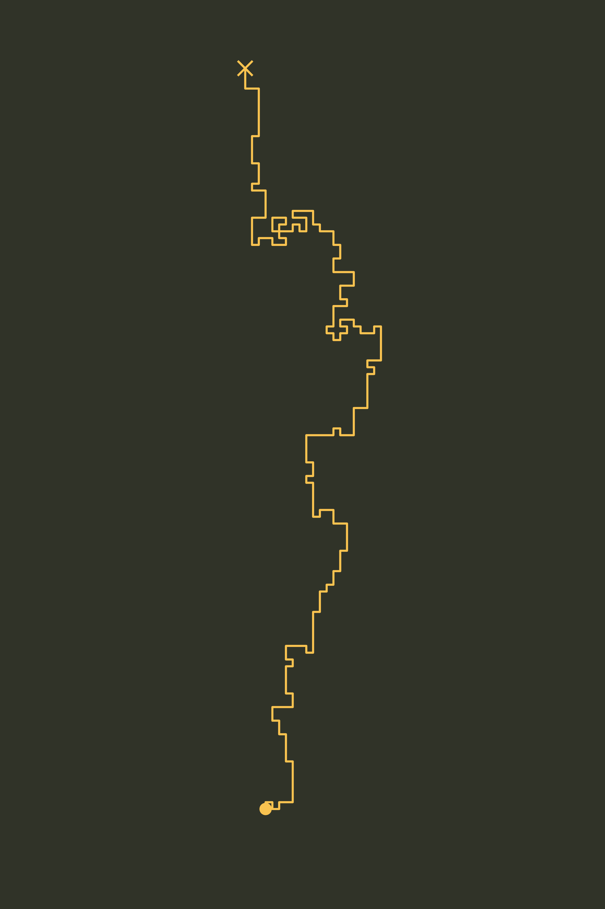

# hamming
Biased Random Walk Simulation (Upward Bias). Emulates the cover of Richard Hamming's "The Art of Doing Science and Engineering" [Learning to Learn]

_El camino hacia el descubrimiento no es todo recto. Es zigzagueante, titubea, cambia de rumbo, pero siempre avanza. La visión le da dirección; la persistencia le da forma._
